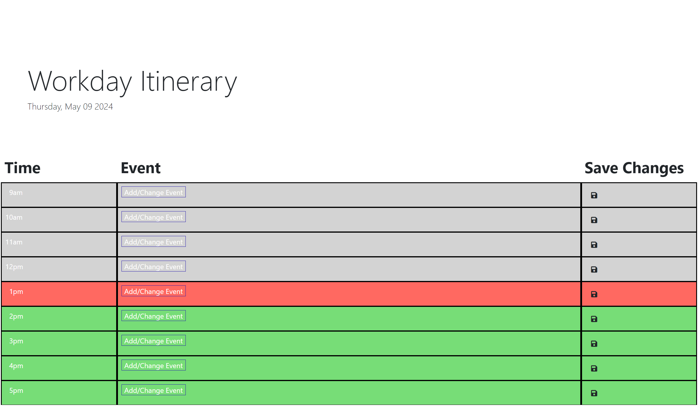

# Daily_Scheduler

## This Daily_Scheduler is built to aid in time-management throughout the day. While making it, I focused on using Day.js and jQuery in the code In doing this, I have learned to better use these tools and practiced JavaScript.

## To use the Daily_Scheduler, click on the appropriate event space and replace the text with an event description. Then click the corresponding save icon to save the event in the scheduler. 

## Katherine Bensley